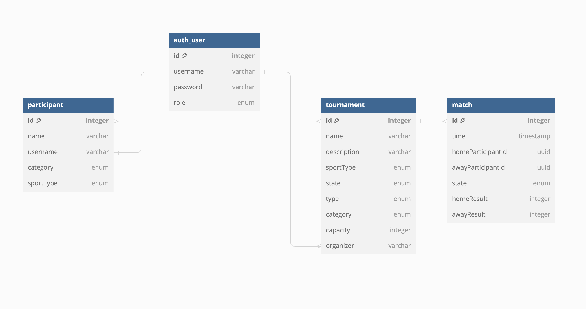

# Tournament Organizer Application 
## Project for our Web Development with Java course, FMI 2024
---

**Tournament Organizer** allows users to create, manage and hold various types of tournaments. You can register to the application as *Participant* or *Organizer*, having the following options:

- **Participant**
  - Create and maintain an Athlete or Team profile.
  - Search, view and register to tournaments.

- **Organizer**
  - Create and maintain Leagues or Knock-Out-Tournaments.
  - Start owned tournaments.
  - Schedule matches for owned tournaments automatically.    

## How to run the application
1. Alter the **application.properies** file as follows 
  + Change {db name} to the name of the database that you intend to use
  + Change {port} to the port on which postgresql is runnig on your machine
        
     ```
      spring.datasource.url=jdbc:postgresql://localhost:{port}/{db name}
     ```
  + Enter your postgres username and password
    
    ```
    spring.datasource.username=    
    spring.datasource.password=
    ```
2. Run `mvn clean install`
3. Run the app

## Simplified Database Schema:


## Application uses: 
- Java 21
- Spring Boot 3.2.4
- Angular
- PostgreSQL
